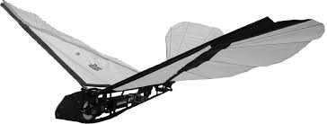

## **Ornithopters – Recent Advancements in Flapping-Wing Flight**

### **Introduction to Ornithopters**

An **ornithopter** is a type of aircraft that uses flapping wings to generate lift and thrust, mimicking the flight of birds, insects, or bats.

---

### **Principles of Flight**

Ornithopters rely on the same basic aerodynamic principles as other flying vehicles, with added complexity due to the flapping wings. These principles include

 Lift,Thrust,Control Surfaces,Flapping Motion

---

### **Recent Advancements in Ornithopter Technology**

---

#### **1. Lightweight and Durable Materials**

One of the biggest challenges in ornithopter design is creating wings that are both lightweight and durable enough to withstand the mechanical stresses of continuous flapping. Modern materials such as **carbon fiber composites**, **flexible polymers**, and **3D-printed structures** are now being used to construct wings that are both strong and lightweight.

- **Carbon Fiber Composites**: These materials offer excellent strength-to-weight ratios, making them ideal for use in ornithopter wings. Carbon fiber also has flexibility, which helps absorb the stresses of wing flapping.
  
- **3D Printing**: Recent advances in 3D printing have enabled the production of complex, lightweight parts with intricate structures that would be difficult or impossible to manufacture using traditional methods. This technology is used to create the frames, wing structures, and actuators for ornithopters.

#### **2. Bio-Inspired Designs**

The latest ornithopter designs take inspiration from the biomechanics of birds and insects, focusing on more natural wing movements and more efficient flight. Researchers are studying **avian** (bird) and **insect** flight patterns to understand how their wings move and generate lift and thrust. This has led to the development of new wing designs that are more efficient in mimicking the natural movement of birds and insects.

- **Flexible Wings**: Some ornithopters now feature wings that can bend and twist, similar to the way birds' wings adjust during flight. This flexibility allows for more efficient aerodynamic performance and better control during flight.
  
- **Flapping and Gliding**: Some designs combine flapping and gliding movements, reducing the energy needed for continuous flapping and making flight more efficient.
---

